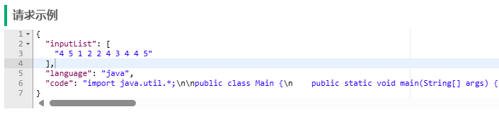

# 基于docker的代码沙箱
> 学习项目，不够完善，见谅

## 简介
项目使用docker容器隔离用户提交的代码，初始化容器池提高并发量。

有两种穿参数方式，基于命令行和用户代码获取（ACM），默认使用后者。
## 快速开始
先构建项目需要的镜像：
``` bash
docker build.-t codesandbox:latest
```
然后执行`voxoj-sandbox-0.0.1-SNAPSHOT.jar`命令启动项目

## 测试
项目集成knife4j，可以直接访问接口文档。
1. 访问地址：http://ip:8090/doc.html
2. 查看请求结构、返回值
3. 使用示例：0-1背包测试
4. 复制代码到调试界面，注意勾选请求头，初始值：secretKey
5. 发送请求，获取结果

## 其他
关闭项目时，容器池会自动清理，通过`@PreDestroy`注解实现，但仍可能会清理失败，注意查看日志。